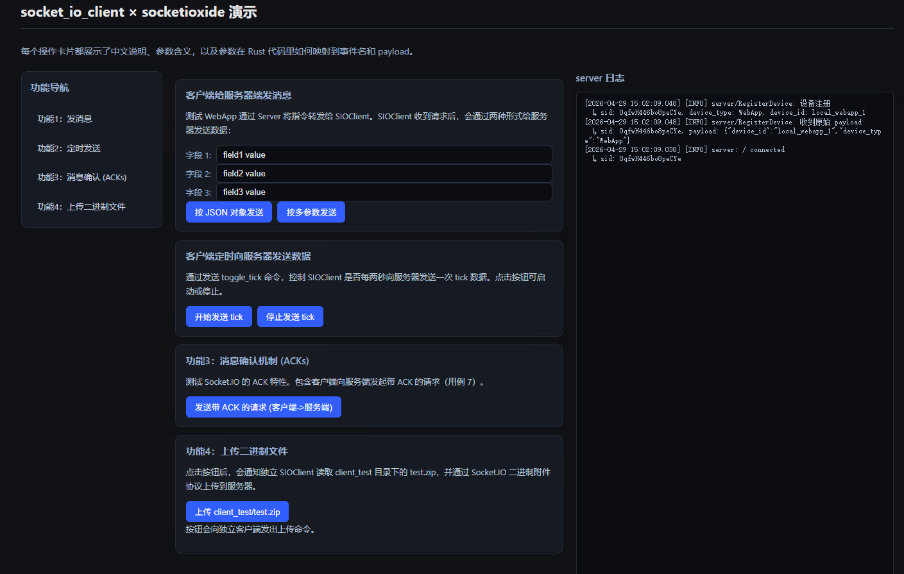

# socket_io_client

`socket_io_client` 是一个用 Rust 编写的简易 Socket.IO 客户端库。

**⚠️ 兼容性提示：** 本客户端目前主要针对 `socketioxide` 服务端进行适配与测试，致力于在 Rust 生态中提供首尾一致的、符合人体工程学的开发体验。它支持通过 `ClientApp` 管理全局状态，能够方便地注册不同命名空间（Namespace），并采用了基于 `Extractor`（提取器）机制的事件路由注册方法，让事件处理函数的签名更加灵活清晰。

## ✨ 核心特性

- **全局状态与命名空间管理**：通过 `ClientApp` 轻松管理客户端全局状态，并支持多命名空间（如 `/`、`/admin`）的独立事件注册。
- **Axum 风格的 Extractor（提取器）**：事件回调函数支持灵活的参数提取，例如 `CSocket<State>`、`CData<Value>`、`CState<State>` 和 `Ack`，无需手动解析上下文。
- **完善的事件收发机制**：
  - 支持 `on_connect`、`on_disconnect` 监听连接生命周期。
  - 支持 `on` 监听自定义事件。
  - 支持 `emit`、`emit_args` 发送 JSON 或多参数事件。
  - 支持带确认机制的 `emit_with_ack`。
- **大文件/二进制数据分片上传（防断线背压）**：支持 `emit_binary_with_ack`，结合 Ack 机制实现天然背压，可防止在发送大体积二进制文件（如 Zip 压缩包）时阻塞 Ping/Pong 心跳导致断线。
- **定时任务集成**：提供 `socket.run_interval` 轻松注册与 Socket 生命周期绑定的定时循环任务。
- **自动重连**：可自定义重连间隔（`set_reconnect_interval`）与超时时间（`set_pong_timeout`）。

## 🚀 快速开始

### 1. 添加依赖

在 `Cargo.toml` 中添加：

```toml
[dependencies]
socket_io_client = "0.1.0"
serde_json = "1.0"
tokio = { version = "1.0", features = ["full"] }
tracing = "0.1"
```

### 2. 编写客户端代码

```rust
use serde_json::{json, Value};
use socket_io_client::{ClientApp, ClientSocketRef, Data as CData, Socket as CSocket, State as CState};
use std::sync::Arc;
use tokio::sync::Mutex;
use tracing::info;

// 1. 定义你的全局状态
#[derive(Clone)]
pub struct AppState {
    pub message_count: Arc<Mutex<usize>>,
}

#[tokio::main]
async fn main() {
    tracing_subscriber::fmt::init();

    let state = AppState {
        message_count: Arc::new(Mutex::new(0)),
    };

    // 2. 初始化 ClientApp
    let mut app = ClientApp::new(state);
    app.set_reconnect_interval(3);
    app.set_pong_timeout(8);

    // 3. 注册命名空间与事件路由
    app.ns("/", |socket: ClientSocketRef<AppState>| async move {
        
        // 监听连接成功事件
        socket.on_connect::<CSocket<AppState>, CState<AppState>, _, _>(
            |CSocket(s), CState(_)| async move {
                info!("连接成功！");
                let _ = s.emit("hello_server", json!({"msg": "hello from client"})).await;
            }
        );

        // 监听断开连接事件
        socket.on_disconnect::<CSocket<AppState>, CState<AppState>, _, _>(
            |CSocket(_), CState(_)| async move {
                info!("连接断开！");
            }
        );

        // 监听自定义事件，并使用 Extractor 提取数据和状态
        socket.on::<CSocket<AppState>, CData<Value>, CState<AppState>, _, _>(
            "server_msg",
            |CSocket(s), CData(data), CState(state)| async move {
                info!("收到服务器消息: {:?}", data);
                
                let mut count = state.message_count.lock().await;
                *count += 1;
                info!("总共收到 {} 条消息", *count);
                
                // 响应消息
                let _ = s.emit("client_reply", json!({"reply": "got it"})).await;
            }
        );
    });

    // 4. 启动并连接到服务端
    app.run("http://127.0.0.1:3000").await;
}
```

## 💡 进阶功能示例

### 发送带 Ack 的请求

```rust
use std::time::Duration;

// ...在 namespace 的注册回调中
socket.on::<CSocket<AppState>, CData<Value>, CState<AppState>, _, _>(
    "get_user_info",
    |CSocket(s), CData(data), CState(_)| async move {
        // 发送带 Ack 的请求，超时时间设为 3 秒
        match s.emit_with_ack("get_user", json!(123), Duration::from_secs(3)).await {
            Ok(res) => info!("成功收到服务端的 ACK 响应: {}", res),
            Err(e) => info!("等待服务端 ACK 超时或失败: {:?}", e),
        }
    }
);
```

### 二进制大文件分片上传

为了避免大量发送二进制数据阻塞心跳导致断线，推荐使用分片和 Ack 机制进行自然背压：

```rust
// ...在 namespace 的注册回调中
let chunk = vec![0u8; 256 * 1024]; // 256KB 分片
let chunk_meta = json!({ "file_name": "test.zip", "chunk_index": 0 });

if let Err(e) = s.emit_binary_with_ack(
    "upload_zip_chunk",
    vec![chunk_meta],
    vec![chunk], // 二进制负载
    Duration::from_secs(5),
).await {
    tracing::warn!("分片上传失败: {}", e);
}
```
*提示：在服务端（如 socketioxide 0.18.x）可通过 `Data::<(Value, bytes::Bytes)>` 提取器同时接收 JSON 元数据与二进制块。*

## 🧪 运行示例项目 (Examples)

本项目在 `examples` 目录下提供了完整的客户端和服务端联调示例。

- **`examples/server_test`**: 基于 Leptos 和 `socketioxide` 搭建的测试服务端。
- **`examples/client_test`**: 基于本库搭建的测试客户端。

**启动联调测试步骤：**

1. 进入服务端目录并启动服务端：
   ```bash
   cd examples/server_test
   cargo leptos watch
   ```
  
2. 等待服务端启动完成（约 3 秒）。
3. 新开一个终端，进入客户端目录并启动客户端：
   ```bash
   cd examples/client_test
   cargo run
   ```

## 🔗 参照项目

本项目的实现和 API 设计主要参考了官方 Socket.IO 客户端和 Rust 生态优秀的库：

- [socket.io-client (Node.js)](https://github.com/socketio/socket.io/tree/main/packages/socket.io-client)
- [socketioxide (Rust Server)](https://github.com/Totodore/socketioxide)

## 📄 许可证

本项目基于 MIT 许可证开源。详细信息请参阅 `LICENSE` 文件。

# socket_io_client

`socket_io_client` is a simple Socket.IO client library written in Rust.

**⚠️ Compatibility Note:** This client is currently mainly adapted and tested against the `socketioxide` server. It is dedicated to providing an ergonomic, end-to-end consistent development experience within the Rust ecosystem. It supports managing global state via `ClientApp`, allows for convenient registration of different namespaces, and adopts an event routing registration method based on an `Extractor` mechanism, making the event handler signatures more flexible and clear.

## ✨ Core Features

- **Global State & Namespace Management**: Easily manage the global state of the client through `ClientApp`, and support independent event registration for multiple namespaces (e.g., `/`, `/admin`).
- **Axum-style Extractors**: Event callback functions support flexible parameter extraction, such as `CSocket<State>`, `CData<Value>`, `CState<State>`, and `Ack`, eliminating the need to manually parse the context.
- **Comprehensive Event Sending & Receiving Mechanism**:
  - Supports `on_connect` and `on_disconnect` to listen to the connection lifecycle.
  - Supports `on` to listen for custom events.
  - Supports `emit` and `emit_args` to send JSON or multi-parameter events.
  - Supports `emit_with_ack` with an acknowledgment mechanism.
- **Large File/Binary Data Chunk Upload (Anti-Disconnect Backpressure)**: Supports `emit_binary_with_ack`, combined with the Ack mechanism to achieve natural backpressure. This prevents blocking Ping/Pong heartbeats and causing disconnections when sending large binary files (like Zip archives).
- **Scheduled Task Integration**: Provides `socket.run_interval` to easily register scheduled loop tasks tied to the Socket lifecycle.
- **Auto Reconnection**: Customizable reconnection interval (`set_reconnect_interval`) and timeout (`set_pong_timeout`).

## 🚀 Quick Start

### 1. Add Dependencies

Add the following to your `Cargo.toml`:

```toml
[dependencies]
socket_io_client = "0.1.0"
serde_json = "1.0"
tokio = { version = "1.0", features = ["full"] }
tracing = "0.1"
```

### 2. Write Client Code

```rust
use serde_json::{json, Value};
use socket_io_client::{ClientApp, ClientSocketRef, Data as CData, Socket as CSocket, State as CState};
use std::sync::Arc;
use tokio::sync::Mutex;
use tracing::info;

// 1. Define your global state
#[derive(Clone)]
pub struct AppState {
    pub message_count: Arc<Mutex<usize>>,
}

#[tokio::main]
async fn main() {
    tracing_subscriber::fmt::init();

    let state = AppState {
        message_count: Arc::new(Mutex::new(0)),
    };

    // 2. Initialize ClientApp
    let mut app = ClientApp::new(state);
    app.set_reconnect_interval(3);
    app.set_pong_timeout(8);

    // 3. Register namespace and event routes
    app.ns("/", |socket: ClientSocketRef<AppState>| async move {
        
        // Listen for the connection success event
        socket.on_connect::<CSocket<AppState>, CState<AppState>, _, _>(
            |CSocket(s), CState(_)| async move {
                info!("Connected successfully!");
                let _ = s.emit("hello_server", json!({"msg": "hello from client"})).await;
            }
        );

        // Listen for the disconnection event
        socket.on_disconnect::<CSocket<AppState>, CState<AppState>, _, _>(
            |CSocket(_), CState(_)| async move {
                info!("Disconnected!");
            }
        );

        // Listen for custom events and use Extractors to extract data and state
        socket.on::<CSocket<AppState>, CData<Value>, CState<AppState>, _, _>(
            "server_msg",
            |CSocket(s), CData(data), CState(state)| async move {
                info!("Received server message: {:?}", data);
                
                let mut count = state.message_count.lock().await;
                *count += 1;
                info!("Total messages received: {}", *count);
                
                // Respond to the message
                let _ = s.emit("client_reply", json!({"reply": "got it"})).await;
            }
        );
    });

    // 4. Start and connect to the server
    app.run("http://127.0.0.1:3000").await;
}
```

## 💡 Advanced Features Examples

### Send a Request with Ack

```rust
use std::time::Duration;

// ... inside the namespace registration callback
socket.on::<CSocket<AppState>, CData<Value>, CState<AppState>, _, _>(
    "get_user_info",
    |CSocket(s), CData(data), CState(_)| async move {
        // Send a request with Ack, set timeout to 3 seconds
        match s.emit_with_ack("get_user", json!(123), Duration::from_secs(3)).await {
            Ok(res) => info!("Successfully received ACK response from server: {}", res),
            Err(e) => info!("Timeout or failed waiting for server ACK: {:?}", e),
        }
    }
);
```

### Binary Large File Chunk Upload

To avoid sending massive binary data blocking the heartbeat and causing a disconnection, it's recommended to use chunking and the Ack mechanism for natural backpressure:

```rust
// ... inside the namespace registration callback
let chunk = vec![0u8; 256 * 1024]; // 256KB chunk
let chunk_meta = json!({ "file_name": "test.zip", "chunk_index": 0 });

if let Err(e) = s.emit_binary_with_ack(
    "upload_zip_chunk",
    vec![chunk_meta],
    vec![chunk], // Binary payload
    Duration::from_secs(5),
).await {
    tracing::warn!("Chunk upload failed: {}", e);
}
```
*Tip: On the server side (e.g., socketioxide 0.18.x), you can use the `Data::<(Value, bytes::Bytes)>` extractor to simultaneously receive JSON metadata and binary chunks.*

## 🧪 Run Example Projects (Examples)

This project provides complete client and server integration testing examples in the `examples` directory.

- **`examples/server_test`**: A test server built with Leptos and `socketioxide`.
- **`examples/client_test`**: A test client built with this library.

**Steps to start the integration test:**

1. Enter the server directory and start the server:
   ```bash
   cd examples/server_test
   cargo leptos watch
   ```
2. Wait for the server to start (about 3 seconds).
3. Open a new terminal, enter the client directory and start the client:
   ```bash
   cd examples/client_test
   cargo run
   ```

## 🔗 Reference Projects

The implementation and API design of this project are mainly inspired by the official Socket.IO client and excellent libraries in the Rust ecosystem:

- [socket.io-client (Node.js)](https://github.com/socketio/socket.io/tree/main/packages/socket.io-client)
- [socketioxide (Rust Server)](https://github.com/Totodore/socketioxide)

## 📄 License

This project is open-sourced under the MIT License. See the `LICENSE` file for details.
